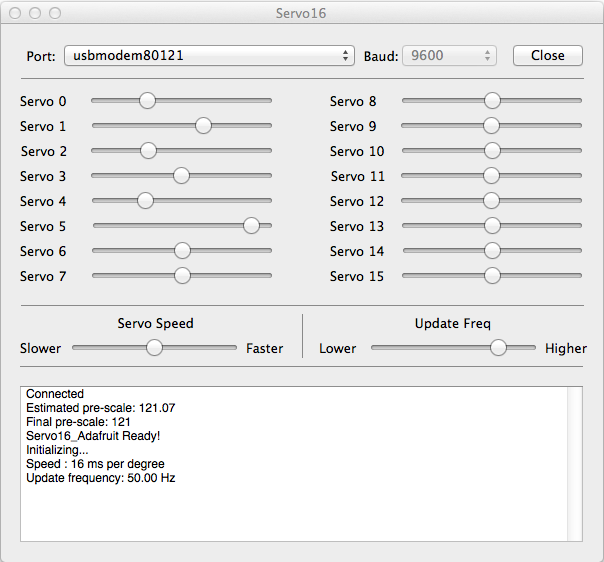

Servo16
=======

Simple OSX app to control servos on an Arduino baord, or any device connected via a serial link.

How it Works
------------

The app lets you connect to any serial device using the Port and Baud controls. 

Any change in one of the servo sliders results in a command string being written to the connected port. The command string has the format:

`{s:<servo-num>:<new-angle>}`

The `<sero-num>` and `<new-angle>` are integers. The angles are in 1000ths of degrees and have the range 0..180000.

Changes to the 'Servo Speed' slider generates the command:

`{rate:<servo-num>:<1000th-degrees-per-second>}`

This is a global speed slider so `<servo-num>` will be -1, meaning all servos. `<1000th-degrees-per-second>` is the number of 1000th degrees to turn in one second.

Changes to the 'Update Freq' slider generates the command:

`{ui:<ms-interval>}`

Where `<ms-interval>` is the time in milliseconds between servo updates.

The `ui` and `rate` commands are meant for use with the [SS_Servorator](https://github.com/solderspot/SS_Servorator) library.

**Note:** If the app recieves the string "Ready!" from the connected device, it will transmit all the current slider states.

Important
---------

Make sure you use V1.1.0 or later of SS_Servorator.

Examples Sketches
-----------------

Examine the README.md in the 'sketches' subfoler to see examples of how to control servos using Servo16.

**Note:** Some of the examples require additional libraries.

You can see the app in action [in this video clip
](http://youtu.be/Ep0Tf669s-o).

Warning
-------

Be very careful when powering servos. It is possible to cause physical damage and/or serious injury while using them. Use this software at your own risk.

